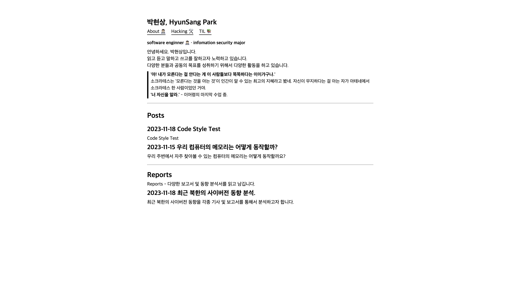

# jekyll-simple-theme
Jekyll를 통해서 제가 원하는 기능이 있는 심플한 테마를 만듭니다.



## Installation
Add this line to your Jekyll site's `Gemfile`:
```ruby
gem "jekyll-simple-theme"
```

And add this line to your Jekyll site's `_config.yml`:

```yaml
theme: jekyll-simple-theme
```

And then execute:
```
$ bundle
```

Or install it yourself as:
```bash
$ gem install jekyll-simple-theme
```

## Usage


## TODOS:
### Post
- [ ] Code Block Style
- [ ] `h1` ~ `h6` Style 
  -  일관적인 코드 스타일 적용 필요함.